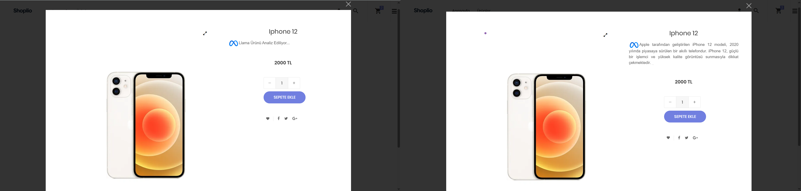

🛒 Shoplio

Shoplio, kullanıcıların ürünleri görüntüleyip, sepetlerine ekleyebildikleri ve sipariş yönetimi yapabildikleri e-ticaret uygulamasıdır. Otokar Otomotiv ve Savunma Sanayi 'de yaptığım yaz stajımda istenilen yol haritasına göre başarıyla teslim edilmiştir. Proje, ASP.NET Core Web API (backend), MS SQL Server (veritabanı) ve React + TypeScript (frontend) teknolojileri ile geliştirilmiştir.

🚀 Özellikler

🔐 Kullanıcı kimlik doğrulama (JwtBearer)

🛍️ Ürün listeleme ve arama

➕ Sepete ürün ekleme, çıkarma

📦 Sipariş oluşturma ve sipariş geçmişi görüntüleme

🤖 Ollama ile ürün analizi (ürün verilerini yapay zeka destekli analiz etme)

🛠️ Kullanılan Teknolojiler

Frontend: React, TypeScript

Backend: ASP.NET Core Web API, Entity Framework Core

Database: MS SQL Server

📌 Yol Haritası

 Auth (login/register)

 Ürün listeleme

 Sepet yönetimi

➕ YAPILACAKLAR

 Sipariş ödeme entegrasyonu

 Admin paneli (ürün ve kategori yönetimi)

 Kullanıcı bildirimleri

 Mobil uyum geliştirmeleri

 Yapay Zeka entegrasyonu (akıllı ürün önerileri, chatbot vb.)

## 🔍 Ürün Analizi (Ollama - Llama 3.1:8B)

Projede, ürünlerin isimlerine göre anlamlı açıklamalar ve analizler üretilmektedir.  
Bu işlem için **Ollama** üzerinde çalışan **Llama 3.1:8B** modeli kullanılmaktadır.  

- **Model:** `llama3.1:8b`  
- **Boyut:** ~4.9 GB  
- **Çalışma Mantığı:**  
  Kullanıcı ürün detayına girdiğinde, ürün ismi modele gönderilir.  
  Llama modeli, ürünün adını doğal dilde yorumlayarak açıklayıcı bir metin üretir.  

- **Amaç:**  
  Ürün hakkında kullanıcıya ek bilgi sağlamak, ürün tanımını zenginleştirmek  
  ve satın alma kararını desteklemektir.  

